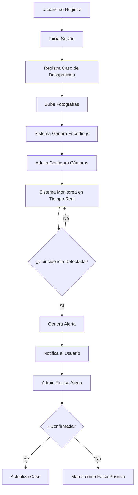

<div align="center">

# 🔍 FaceFind

### Sistema Inteligente de Reconocimiento Facial para Localización de Personas Desaparecidas

[](https://github.com/GusGus27/FaceFind/actions/workflows/ci-cd.yml)
[](https://python.org)
[](https://reactjs.org)
[](https://flask.palletsprojects.com)
[](https://supabase.com)
[](LICENSE)

<p align="center">
  <strong>🎯 Solución tecnológica que utiliza inteligencia artificial y visión por computadora para ayudar en la búsqueda y localización de personas desaparecidas mediante reconocimiento facial en tiempo real.</strong>
</p>

[Características](#-características) •
[Demo](#-demo) •
[Arquitectura](#%EF%B8%8F-arquitectura) •
[Instalación](#-instalación) •
[Documentación](#-documentación) •
[Contribuir](#-contribuir)

</div>

---

## 📋 Tabla de Contenidos

- [Descripción General](#-descripción-general)
- [Características Principales](#-características-principales)
- [Tecnologías Utilizadas](#-tecnologías-utilizadas)
- [Arquitectura del Sistema](#%EF%B8%8F-arquitectura-del-sistema)
- [Modelo de Datos](#-modelo-de-datos)
- [Instalación y Configuración](#-instalación-y-configuración)
- [Uso del Sistema](#-uso-del-sistema)
- [API Reference](#-api-reference)
- [CI/CD y DevOps](#-cicd-y-devops)
- [Equipo de Desarrollo](#-equipo-de-desarrollo)
- [Contribuir](#-contribuir)
- [Licencia](#-licencia)

---

## 🎯 Descripción General

**FaceFind** es una plataforma integral diseñada para asistir en la búsqueda de personas desaparecidas utilizando tecnología de reconocimiento facial de última generación. El sistema permite:

- 📸 **Registro de casos** con información detallada y fotografías de referencia
- 🎥 **Monitoreo en tiempo real** mediante integración con cámaras IP y USB
- 🧠 **Detección automática** utilizando algoritmos de deep learning para reconocimiento facial
- 🚨 **Sistema de alertas** instantáneas cuando se detecta una coincidencia
- 📊 **Dashboard analítico** con estadísticas, mapas de calor y métricas de rendimiento
- 📧 **Notificaciones por email** para mantener informados a los usuarios

### 🌟 ¿Por qué FaceFind?

| Problema | Solución FaceFind |
|----------|-------------------|
| Búsqueda manual ineficiente | Detección automática 24/7 |
| Falta de coordinación | Plataforma centralizada |
| Tiempo de respuesta lento | Alertas en tiempo real |
| Pérdida de información | Base de datos estructurada |
| Sin métricas de progreso | Dashboard con estadísticas |

---

## ✨ Características Principales

### 🔐 Sistema de Autenticación
- Registro y login seguro con validación de email
- Recuperación de contraseña via email
- Roles y permisos (Administrador/Usuario)
- Protección de rutas y endpoints

### 👤 Gestión de Casos
- Formulario multi-paso para registro completo
- Información personal y características físicas
- Circunstancias de desaparición
- Datos de contacto del reportante
- Subida de múltiples fotografías de referencia

### 🧠 Motor de Reconocimiento Facial
- Generación automática de encodings faciales
- Comparación en tiempo real con base de datos
- Umbral de similitud configurable
- Detección de múltiples rostros simultáneos
- Soporte para modelo HOG y CNN

### 📹 Gestión de Cámaras
- Soporte para cámaras USB e IP
- Configuración de resolución y FPS
- Geolocalización de cámaras
- Activación/desactivación remota
- Estadísticas por cámara

### 🚨 Sistema de Alertas
- Generación automática al detectar coincidencia
- Priorización por nivel de similitud
- Estados: Pendiente, Revisada, Falso Positivo
- Captura de evidencia (frame del video)
- Línea temporal de movimientos

### 🗺️ Mapa Interactivo
- Visualización de alertas geolocalizadas
- Clustering de marcadores
- Filtros por caso, fecha y cámara
- Línea temporal de movimientos
- Exportación de datos

### 📊 Dashboard de Estadísticas
- Métricas en tiempo real
- Gráficos de distribución de casos
- Análisis demográfico
- Métricas de detección y precisión
- Estadísticas por cámara
- Tendencias temporales

### 📄 Generación de Reportes
- Exportación a Excel con gráficos
- Exportación a CSV
- Filtros personalizados
- Resúmenes estadísticos

### 🔔 Sistema de Notificaciones
- Notificaciones en tiempo real
- Clasificación por severidad
- Integración con SendGrid para emails
- Panel de notificaciones en la UI

---

## 🛠 Tecnologías Utilizadas

### Backend
| Tecnología | Uso |
|------------|-----|
|  | Lenguaje principal del backend |
|  | Framework web REST API |
|  | Procesamiento de video e imágenes |
|  | Detección y encoding facial (dlib) |
|  | Operaciones numéricas |
|  | Envío de emails |
|  | Generación de reportes Excel |
|  | Generación de PDFs |

### Frontend
| Tecnología | Uso |
|------------|-----|
|  | Framework UI |
|  | Build tool |
|  | Enrutamiento SPA |
|  | Gráficos y visualizaciones |
|  | Mapas interactivos |
|  | Cliente HTTP |
|  | Iconografía |

### Base de Datos y Cloud
| Tecnología | Uso |
|------------|-----|
|  | PostgreSQL + Auth + Storage |
|  | Base de datos relacional |

### DevOps
| Tecnología | Uso |
|------------|-----|
|  | Integración continua |
|  | Análisis de código JS |
|  | Análisis de código Python |
|  | Análisis de seguridad |
|  | Formateo de código |

---

## 🏗️ Arquitectura del Sistema

```
┌─────────────────────────────────────────────────────────────────────────────┐
│                              FACEFIND ARCHITECTURE                          │
├─────────────────────────────────────────────────────────────────────────────┤
│                                                                             │
│  ┌─────────────┐     ┌─────────────┐     ┌─────────────┐                   │
│  │   Browser   │     │  Mobile App │     │  IP Camera  │                   │
│  │   (React)   │     │   (Future)  │     │   Streams   │                   │
│  └──────┬──────┘     └──────┬──────┘     └──────┬──────┘                   │
│         │                   │                   │                          │
│         └───────────────────┴───────────────────┘                          │
│                             │                                               │
│                             ▼                                               │
│  ┌──────────────────────────────────────────────────────────────────────┐  │
│  │                         FLASK REST API                                │  │
│  │  ┌─────────────────────────────────────────────────────────────────┐ │  │
│  │  │                      API BLUEPRINTS                              │ │  │
│  │  │  ┌─────────┐ ┌─────────┐ ┌─────────┐ ┌─────────┐ ┌─────────┐   │ │  │
│  │  │  │  Auth   │ │  Cases  │ │ Cameras │ │ Alerts  │ │ Reports │   │ │  │
│  │  │  └────┬────┘ └────┬────┘ └────┬────┘ └────┬────┘ └────┬────┘   │ │  │
│  │  └───────┴───────────┴───────────┴───────────┴───────────┴────────┘ │  │
│  │                                  │                                   │  │
│  │  ┌───────────────────────────────▼───────────────────────────────┐  │  │
│  │  │                       SERVICE LAYER                            │  │  │
│  │  │  ┌──────────────┐  ┌──────────────┐  ┌──────────────────────┐ │  │  │
│  │  │  │ UserService  │  │ CaseService  │  │ FaceDetectionService │ │  │  │
│  │  │  ├──────────────┤  ├──────────────┤  ├──────────────────────┤ │  │  │
│  │  │  │AlertaService │  │CameraService │  │  NotificationService │ │  │  │
│  │  │  ├──────────────┤  ├──────────────┤  ├──────────────────────┤ │  │  │
│  │  │  │ReportService │  │ EmailService │  │  StatisticsService   │ │  │  │
│  │  │  └──────────────┘  └──────────────┘  └──────────────────────┘ │  │  │
│  │  └───────────────────────────────────────────────────────────────┘  │  │
│  │                                  │                                   │  │
│  │  ┌───────────────────────────────▼───────────────────────────────┐  │  │
│  │  │                     REPOSITORY LAYER                           │  │  │
│  │  │     ┌─────────────────────┐    ┌─────────────────────┐        │  │  │
│  │  │     │   UserRepository    │    │ StatisticsRepository│        │  │  │
│  │  │     └─────────────────────┘    └─────────────────────┘        │  │  │
│  │  └───────────────────────────────────────────────────────────────┘  │  │
│  │                                  │                                   │  │
│  │  ┌───────────────────────────────▼───────────────────────────────┐  │  │
│  │  │                       MODEL LAYER (OOP)                        │  │  │
│  │  │  Usuario │ Caso │ Alerta │ Camara │ Encoding │ Notificacion   │  │  │
│  │  └───────────────────────────────────────────────────────────────┘  │  │
│  └──────────────────────────────────────────────────────────────────────┘  │
│                                     │                                       │
│                                     ▼                                       │
│  ┌──────────────────────────────────────────────────────────────────────┐  │
│  │                         SUPABASE (BaaS)                               │  │
│  │  ┌────────────────┐  ┌────────────────┐  ┌────────────────┐          │  │
│  │  │   PostgreSQL   │  │    Storage     │  │ Authentication │          │  │
│  │  │   (Database)   │  │   (Buckets)    │  │     (Auth)     │          │  │
│  │  └────────────────┘  └────────────────┘  └────────────────┘          │  │
│  └──────────────────────────────────────────────────────────────────────┘  │
│                                                                             │
└─────────────────────────────────────────────────────────────────────────────┘
```

### Patrones de Diseño Implementados

- **🏭 Repository Pattern**: Abstracción de acceso a datos
- **🔧 Service Layer**: Lógica de negocio encapsulada
- **📦 MVC/Blueprint Pattern**: Separación de rutas en Flask
- **🎨 Component-Based Architecture**: Componentes React reutilizables
- **🔒 Context API**: Manejo de estado global (AuthContext)
- **🏗️ Factory Pattern**: Creación de cámaras (USB/IP)

---

## 📊 Modelo de Datos

```
┌──────────────────────────────────────────────────────────────────────────┐
│                          DIAGRAMA ENTIDAD-RELACIÓN                       │
└──────────────────────────────────────────────────────────────────────────┘

    ┌─────────────┐         ┌─────────────────────┐         ┌─────────────┐
    │     Rol     │────────<│      UsuarioRol     │>────────│   Usuario   │
    ├─────────────┤         └─────────────────────┘         ├─────────────┤
    │ id          │                                         │ id          │
    │ nombre      │                                         │ nombre      │
    │ descripcion │                                         │ email       │
    └─────────────┘                                         │ password    │
          │                                                 │ dni         │
          │                                                 │ status      │
    ┌─────▼─────┐                                          └──────┬──────┘
    │  Permiso  │                                                 │
    └───────────┘                                                 │
                                                                  │
                              ┌────────────────────────────────────┘
                              │
                              ▼
    ┌─────────────────────────────────────────┐
    │                  Caso                   │
    ├─────────────────────────────────────────┤
    │ id, usuario_id, persona_id              │
    │ fecha_desaparicion, lugar_desaparicion  │
    │ status, priority, circumstances         │
    │ reporter_name, contact_phone            │
    └──────────────────┬──────────────────────┘
                       │
         ┌─────────────┼─────────────┐
         │             │             │
         ▼             ▼             ▼
┌─────────────┐ ┌─────────────┐ ┌─────────────────────┐
│   Alerta    │ │FotoReferencia│ │PersonaDesaparecida│
├─────────────┤ ├─────────────┤ ├─────────────────────┤
│ id          │ │ id          │ │ id                  │
│ caso_id     │ │ caso_id     │ │ nombre_completo     │
│ camara_id   │ │ ruta_archivo│ │ fecha_nacimiento    │
│ timestamp   │ └──────┬──────┘ │ gender, altura, peso│
│ similitud   │        │        │ características     │
│ estado      │        ▼        └─────────────────────┘
│ prioridad   │ ┌─────────────┐
│ imagen      │ │  Embedding  │
└──────┬──────┘ ├─────────────┤
       │        │ id          │
       │        │ foto_ref_id │
       ▼        │ vector      │
┌─────────────┐ │ caso_id     │
│   Camara    │ └─────────────┘
├─────────────┤
│ id          │         ┌─────────────┐
│ ip          │         │Notificacion │
│ ubicacion   │         ├─────────────┤
│ type (IP/USB)│        │ id          │
│ activa      │         │ title       │
│ resolution  │         │ message     │
│ fps         │         │ severity    │
│ latitud     │         │ type        │
│ longitud    │         │ isRead      │
└─────────────┘         └─────────────┘
```

---

## 🚀 Instalación y Configuración

### Prerrequisitos

- **Python 3.11+**
- **Node.js 18+ y npm**
- **CMake** (requerido para dlib/face_recognition)
- **Visual Studio Build Tools** (Windows) o **build-essential** (Linux)
- **Cuenta en Supabase** (gratuita)

### 1️⃣ Clonar el Repositorio

```bash
git clone https://github.com/GusGus27/FaceFind.git
cd FaceFind
```

### 2️⃣ Configurar el Backend

```bash
# Navegar al directorio del backend
cd facefind_back

# Crear entorno virtual
python -m venv venv

# Activar entorno virtual
# Windows:
venv\Scripts\activate
# Linux/Mac:
source venv/bin/activate

# Instalar dependencias
pip install -r requirements.txt
```

#### Configurar Variables de Entorno

Crear archivo `.env` en `facefind_back/`:

```env
# Supabase
SUPABASE_URL=https://tu-proyecto.supabase.co
SUPABASE_KEY=tu-anon-key
SUPABASE_SERVICE_ROLE_KEY=tu-service-role-key

# Flask
FLASK_DEBUG=True
FLASK_HOST=0.0.0.0
FLASK_PORT=5000
SECRET_KEY=tu-secret-key-seguro

# Face Detection
FACE_TOLERANCE=0.6
ENCODINGS_FILE=encodings.pickle

# SendGrid (opcional, para emails)
SENDGRID_API_KEY=tu-sendgrid-api-key
SENDGRID_FROM_EMAIL=noreply@tudominio.com
```

#### Iniciar el Backend

```bash
python app.py
```

El servidor estará disponible en `http://localhost:5000`

### 3️⃣ Configurar el Frontend

```bash
# Navegar al directorio del frontend
cd ../facefind_front

# Instalar dependencias
npm install

# Iniciar servidor de desarrollo
npm run dev
```

La aplicación estará disponible en `http://localhost:5173`

### 4️⃣ Configurar Base de Datos

1. Crear proyecto en [Supabase](https://supabase.com)
2. Ejecutar el schema SQL ubicado en `facefind_back/db/db_schema.sql`
3. Configurar Storage buckets para fotos y evidencias
4. Copiar las credenciales al archivo `.env`

---

## 📖 Uso del Sistema

### Flujo Principal



### Roles del Sistema

| Rol | Permisos |
|-----|----------|
| **Usuario** | Registrar casos, ver sus casos, recibir notificaciones |
| **Administrador** | Todo lo anterior + gestionar cámaras, revisar alertas, ver estadísticas, gestionar usuarios |

---

## 📡 API Reference

### Autenticación
| Método | Endpoint | Descripción |
|--------|----------|-------------|
| `POST` | `/auth/signup` | Registrar nuevo usuario |
| `POST` | `/auth/signin` | Iniciar sesión |
| `POST` | `/auth/signout` | Cerrar sesión |

### Casos
| Método | Endpoint | Descripción |
|--------|----------|-------------|
| `GET` | `/casos` | Listar todos los casos |
| `POST` | `/casos` | Crear nuevo caso |
| `GET` | `/casos/:id` | Obtener caso específico |
| `PUT` | `/casos/:id` | Actualizar caso |
| `DELETE` | `/casos/:id` | Eliminar caso |

### Cámaras
| Método | Endpoint | Descripción |
|--------|----------|-------------|
| `GET` | `/cameras` | Listar cámaras |
| `POST` | `/cameras` | Crear cámara |
| `PUT` | `/cameras/:id` | Actualizar cámara |
| `DELETE` | `/cameras/:id` | Eliminar cámara |
| `PATCH` | `/cameras/:id/toggle` | Activar/Desactivar |
| `GET` | `/cameras/stats` | Estadísticas de cámaras |

### Detección Facial
| Método | Endpoint | Descripción |
|--------|----------|-------------|
| `GET` | `/detection/status` | Estado del servicio |
| `POST` | `/detection/detect-faces` | Detectar rostros en imagen |
| `GET` | `/detection/get-known-faces` | Obtener encodings conocidos |
| `POST` | `/detection/reload-encodings` | Recargar encodings |

### Alertas
| Método | Endpoint | Descripción |
|--------|----------|-------------|
| `GET` | `/alertas` | Listar alertas (con filtros) |
| `GET` | `/alertas/geojson` | Alertas en formato GeoJSON |
| `GET` | `/alertas/timeline` | Línea temporal de movimientos |
| `PATCH` | `/alertas/:id/estado` | Actualizar estado |
| `POST` | `/alertas/:id/revisar` | Marcar como revisada |
| `POST` | `/alertas/:id/falso-positivo` | Marcar como falso positivo |

### Estadísticas
| Método | Endpoint | Descripción |
|--------|----------|-------------|
| `GET` | `/statistics/overview` | Dashboard general |
| `GET` | `/statistics/temporal` | Análisis temporal |
| `GET` | `/statistics/demographics` | Análisis demográfico |
| `GET` | `/statistics/detection-metrics` | Métricas de detección |
| `GET` | `/statistics/camera-stats` | Estadísticas por cámara |

### Reportes
| Método | Endpoint | Descripción |
|--------|----------|-------------|
| `GET` | `/reports/export/excel` | Exportar a Excel |
| `GET` | `/reports/export/csv` | Exportar a CSV |

---

## 🔄 CI/CD y DevOps

### GitHub Actions Workflows

El proyecto implementa integración continua con los siguientes workflows:

#### CI/CD Pipeline (`ci-cd.yml`)
```yaml
# Ejecuta en push a main/develop y PRs
- Backend Tests & Quality
  - Lint con Flake8
  - Análisis de seguridad con Bandit
  - Verificación de formato con Black
  - Tests con pytest + coverage

- Frontend Tests & Build
  - Lint con ESLint
  - Build de producción
  - Tests (cuando estén configurados)
```

### Scripts Disponibles

```bash
# Backend
python app.py          # Iniciar servidor
pytest                 # Ejecutar tests
flake8 .              # Linting
black .               # Formateo

# Frontend
npm run dev           # Desarrollo
npm run build         # Build producción
npm run lint          # Linting
npm run preview       # Preview build
```

---

## 📹 Integración con Cámaras IP

### Ejemplo: Usar Celular como Cámara

1. **Instalar IP Webcam** (Android) desde Play Store
2. **Iniciar servidor** en la app
3. **Configurar en FaceFind:**
   ```
   Tipo: Cámara IP
   URL: http://192.168.1.X:8080/video
   Resolución: 1280x720
   FPS: 20
   ```

### Cámaras de Seguridad Compatibles

- MJPEG streams
- RTSP (con conversión)
- HTTP video streams

> 📚 **Guía completa:** [facefind_front/docs/GUIA_CAMARA_IP.md](facefind_front/docs/GUIA_CAMARA_IP.md)

---

## 📁 Estructura del Proyecto

```
FaceFind/
├── 📁 facefind_back/           # Backend Python/Flask
│   ├── 📁 api/                 # Blueprints (rutas REST)
│   │   ├── auth_routes.py      # Autenticación
│   │   ├── caso_routes.py      # Gestión de casos
│   │   ├── camera_routes.py    # Gestión de cámaras
│   │   ├── detection_routes.py # Detección facial
│   │   ├── alerta_routes.py    # Sistema de alertas
│   │   └── ...
│   ├── 📁 models/              # Modelos OOP
│   │   ├── usuario.py
│   │   ├── caso.py
│   │   ├── alerta.py
│   │   └── ...
│   ├── 📁 services/            # Lógica de negocio
│   │   ├── face_detection_service.py
│   │   ├── alerta_service.py
│   │   ├── notification_service.py
│   │   └── ...
│   ├── 📁 repositories/        # Acceso a datos
│   ├── 📁 db/                  # Esquemas SQL
│   ├── app.py                  # Entry point
│   ├── config.py               # Configuración
│   └── requirements.txt
│
├── 📁 facefind_front/          # Frontend React
│   ├── 📁 src/
│   │   ├── 📁 components/      # Componentes React
│   │   │   ├── 📁 admin/       # Panel administrador
│   │   │   ├── 📁 camera/      # Gestión cámaras
│   │   │   ├── 📁 cases/       # Gestión casos
│   │   │   └── ...
│   │   ├── 📁 views/           # Vistas/Páginas
│   │   ├── 📁 services/        # Servicios API
│   │   ├── 📁 context/         # React Context
│   │   ├── 📁 styles/          # CSS
│   │   └── App.jsx
│   ├── package.json
│   └── vite.config.js
│
├── 📁 .github/
│   └── 📁 workflows/           # GitHub Actions
│       └── ci-cd.yml
│
└── README.md
```

---

## 👥 Equipo de Desarrollo

<table>
  <tr>
    <td align="center">
      <strong>Desarrollo Full Stack</strong>
    </td>
  </tr>
</table>

Este proyecto fue desarrollado como parte de un proyecto académico, aplicando metodologías ágiles y buenas prácticas de desarrollo de software.

---

## 🤝 Contribuir

¡Las contribuciones son bienvenidas! Por favor, sigue estos pasos:

1. **Fork** el repositorio
2. **Crea** una rama para tu feature (`git checkout -b feature/AmazingFeature`)
3. **Commit** tus cambios (`git commit -m 'Add: AmazingFeature'`)
4. **Push** a la rama (`git push origin feature/AmazingFeature`)
5. **Abre** un Pull Request

### Convenciones de Commits

```
feat: nueva característica
fix: corrección de bug
docs: documentación
style: formato, sin cambios de código
refactor: refactorización
test: añadir tests
chore: mantenimiento
```

---

## 📄 Licencia

Este proyecto está bajo la Licencia MIT - ver el archivo [LICENSE](LICENSE) para más detalles.

---

<div align="center">

### ⭐ Si este proyecto te fue útil, considera darle una estrella

[](https://github.com/GusGus27/FaceFind/stargazers)

**Hecho con ❤️ para ayudar a encontrar personas desaparecidas**

</div>